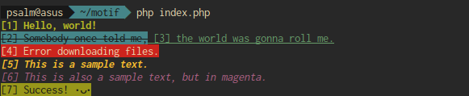

# Motif

A simple PHP tool for formatting output text on a terminal.


## Installation

**TODO**

Generate the autoloader among other things:

```
composer install [--no-dev]
```

> If you want to skip installing PHPUnit (which isn't exactly a small framework), you can add the flag `--no-dev` to exclude it.


## Usage

```php
<?php
// index.php
require 'vendor/autoload.php';
use Motif\Formatter;

// Prints "Hello, world!" (bold and underlined)
// in black with a cyan backgound color on console
echo Formatter::format(
    'Hello, world!',
    ['bold', 'underline'],
    'black', 'cyan'
);

// Prints "Error downloading files." in white with a red background
echo Formatter::colorize('Error downloading files.', 'error');
```

The above code would bring about:




## Contributions

If you spot bugs or have any suggestions, feel free to add them to the issue tracker.
